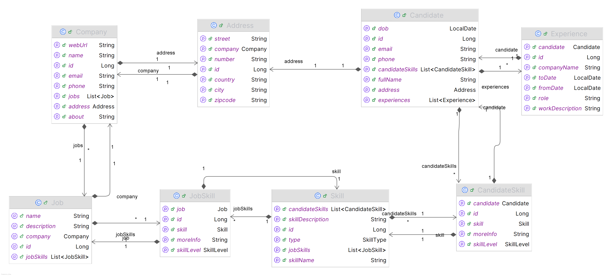
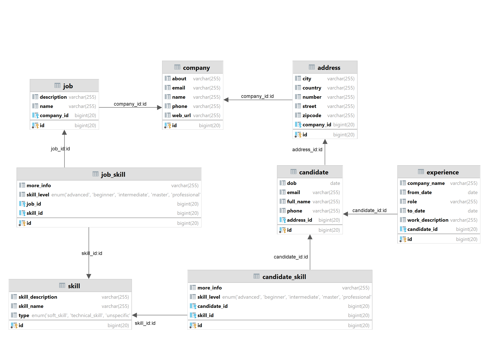
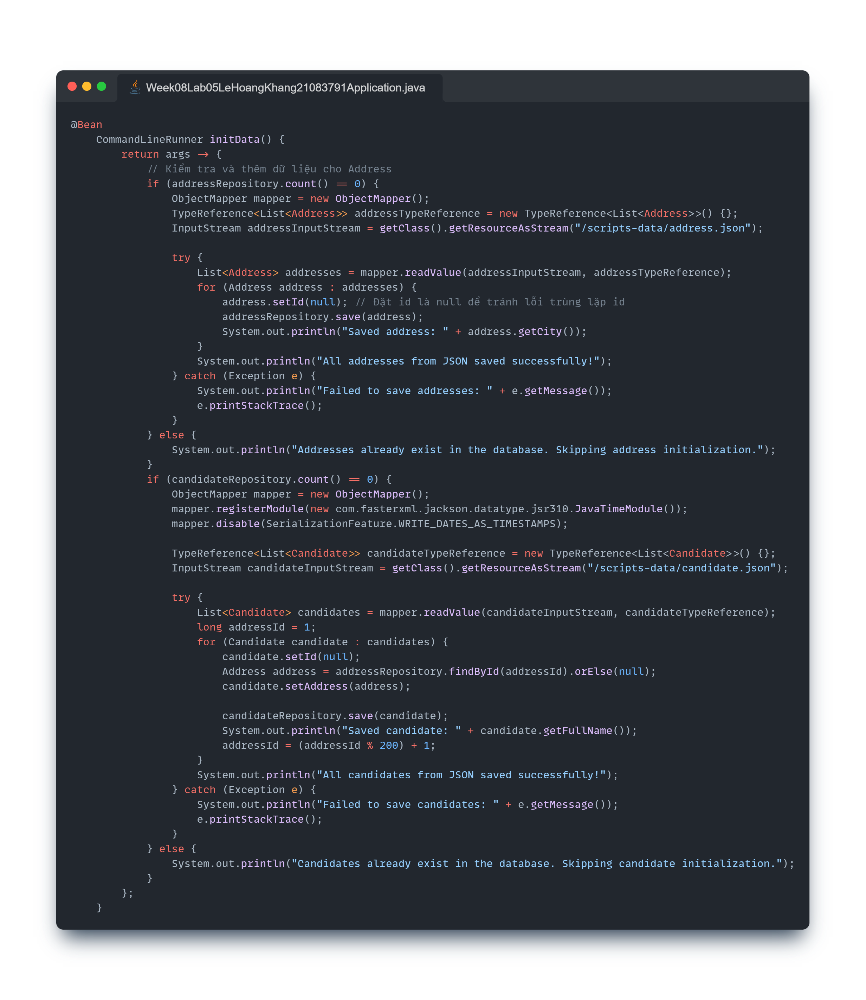
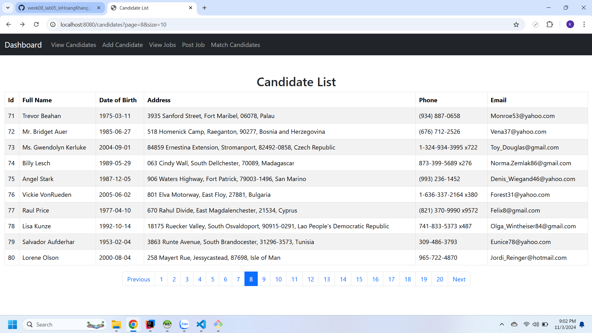
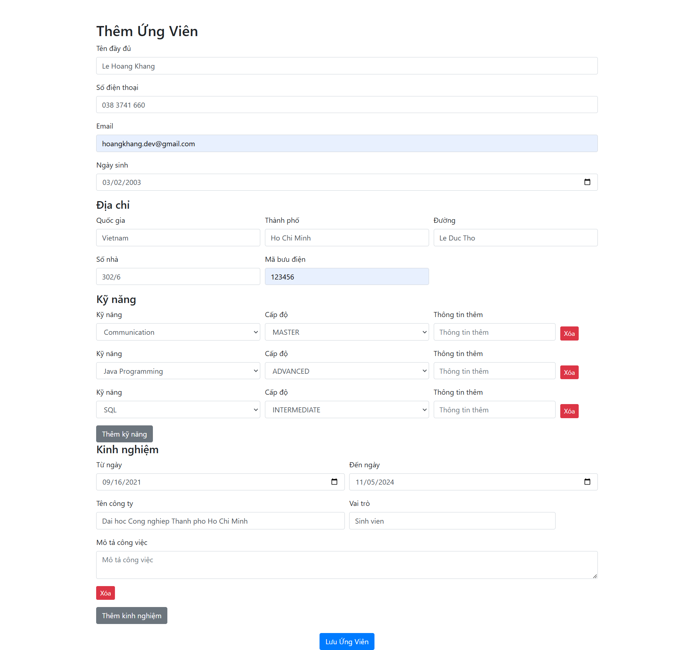
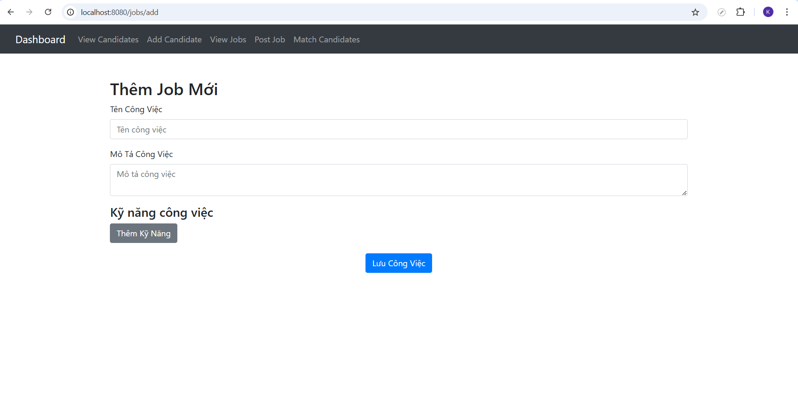
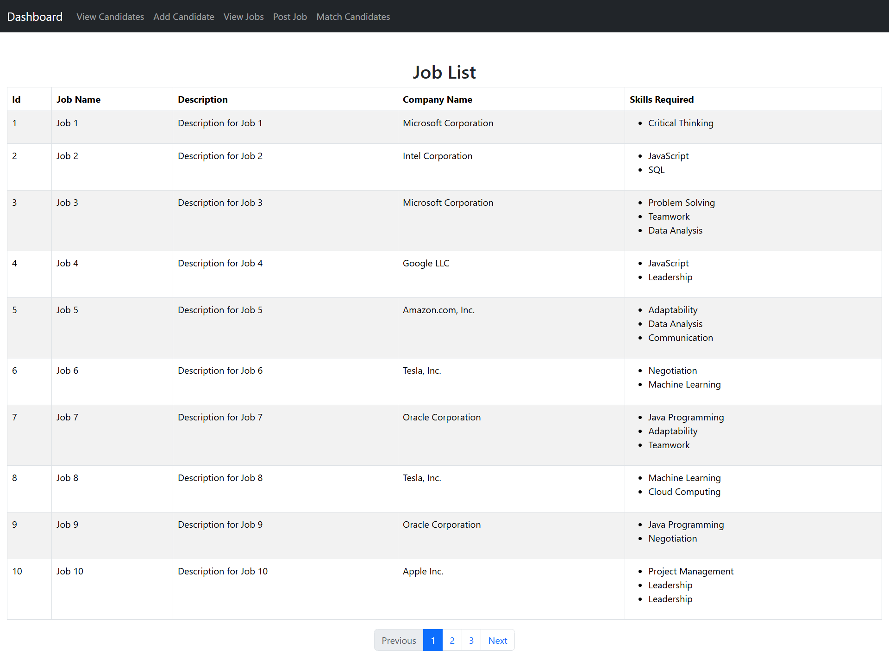

**1. Tạo entity và database**
   1. Class Diagram
      
   2. Database Diagram
      
**2. Hiển thị danh sách ứng viên (Có phân trang)**
      1. Init data (Khởi tạo dữ liệu mẫu cho ứng viên và địa chỉ từ hai file là [address.json](./src/main/resources/scripts-data/address.json) và [candidate.json](./src/main/resources/scripts-data/candidate.json)) 
         
      2. Hiển thị danh sách các ứng viên có phân trang:
         
**3. Thêm ứng viên mới**

**4. Thêm Job mới**

**5. Hiển thị danh sách Job có trong hệ thống**
