# Job Portal

- **Họ tên**: Lê Hoàng Khang
- **Email**: iamhoangkhang@icloud.com
- **LinkedIn**: [linkedin.com/in/iamhoangkhang](https://www.linkedin.com/in/khang-l%C3%AA-1a33132ba/)

## 1. Giới thiệu
### 1.1 Mô tả dự án
Dự án là 1 website tuyển dụng nhân sự, cho phép người dùng tìm kiếm việc làm, đăng tin tuyển dụng, xem thông tin công ty, bên cạnd đó là áp dụng các thuật toán máy học để gợi ý việc làm phù hợp với người dùng.
<br>
Người dùng web được chia làm 3 loại: Người dùng khách, tài khoản ứng viên và tài khoản cho doanh nghiệp:
- **Người dùng khách:** Có thể xem tin tuyển dụng, tìm kiếm việc làm, xem thông tin công ty, xem thống kê tình hình việc làm.
- **Tài khoản ứng viên:** Có thể tìm kiếm việc làm, xem thông tin công ty, đăng tin tuyển dụng, được gợi ý việc làm phù hợp với các kĩ năng của bản thân, xem thống kê tình hình việc làm, cập nhật profile cá nhân, ứng tuyển tin tuyển dụng.
- **Tài khoản doanh nghiệp:** Có thể đăng, cập nhật, xem tin tuyển dụng, xem thông tin ứng viên, xem thống kê tình hình việc làm, cập nhật profile công ty, xem thông tin ứng viên đã ứng tuyển tin tuyển dụng của công ty.
  <br>

### 1.2 Công nghệ sử dụng
- **Backend**: Spring Boot (Java)
- **Frontend**: HTML, CSS, JavaScript, Bootstrap
- **Template Engine**: Thymeleaf
- **Database**: MariaDB
- **Công cụ Build**: Gradle
- **Bảo mật**: Spring Security (Dùng để xác thực người dùng, phân quyền truy cập)
- **ORM**: Spring Data JPA
- **Công cụ quản lý phiên bản**: Git
- **IDE**: IntelliJ IDEA
- **Mechine Learning**: Sử dụng thuật toán **RandomForest (Weka)** để gợi ý việc làm phù hợp với các kĩ năng của người dùng.
- **Data visualization**: Chart.js
- **Công nghệ khác**: Lombok
---

## 2. Cài đặt và triển khai

### 2.1 Yêu cầu hệ thống
- **Java Development Kit (JDK)** phiên bản >= 17
- **Công cụ build**: Gradle
- **MariaDB**
- **IDE**: IntelliJ IDEA or Visual Studio Code
- **Trình duyệt**: Chrome, Firefox, Safari, ...
- **Hệ điều hành**: Windows, MacOS, Linux

### 2.2 Cách chạy dự án
1. **Clone repository**:
    ```bash
    git clone https://github.com/iamKhang/week08_lab05_leHoangKhang_21083791
    cd week08_lab05_leHoangKhang_21083791
    ```
2. **Cấu hình cơ sở dữ liệu**:
   - Mở file `application.properties`.
   - Cập nhật thông tin kết nối database:
       ```properties
       spring.datasource.url=jdbc:mariadb://localhost:3306/candidate_db?createDatabaseIfNotExist=true
       spring.datasource.username=root
       spring.datasource.password=123456
       ```
3. **Chạy ứng dụng**:
   - Mở terminal và chạy lệnh:
       ```bash
       gradle bootRun
       ```
   - Hoặc chạy ứng dụng trên IDE.
     <br>(Chú ý: Cần xóa database có tên `candidate_db` trước khi chạy ứng dụng)
     <br>Dữ liệu được khởi tạo tự động bằng file [DataInitializer.java](https://github.com/iamKhang/week08_lab05_leHoangKhang_21083791/blob/main/src/main/java/vn/edu/iud/fit/lehoangkhang/week08_lab05_lehoangkhang_21083791/utils/DataInitializer.java)
4. **Truy cập ứng dụng**:
   - Mở trình duyệt và truy cập [http://localhost:8080](http://localhost:8080).
   - Tài khoản demo:
     - **Ứng viên:**
       -   Email: iamhoangkhang@icloud.com
       - Password: khang2003
     - **Doanh nghiệp:**
       - Email: fptsoftware@gmail.com
       - Password: khang2003
---

## 3. Chức năng chính

### 3.1 Người dùng khách
- Đăng nhập/Đăng ký
- Xem danh sách công việc
- Xem thống kê tình hình việc làm
### 3.2 Tài khoản ứng viên
- Đăng nhập/Đăng ký
- Xem danh sách công việc
- Xem thống kê tình hình việc là
- Cập nhật profile cá nhân
- Ứng tuyển
- Xem gợi ý công việc phù hợp với kĩ năng của bản thân
### 3.3 Tài khoản doanh nghiệp
- Đăng nhập/Đăng ký
- Xem danh sách công việc
- Xem thống kê tình hình việc làm
- Cập nhật profile công ty
- Đăng tin tuyển dụng
- Xem thông tin ứng viên đã ứng tuyển tin tuyển dụng của công ty
- Xem thông tin các việc đã đăng tin tuyển dụng

---
## 4. Sơ đồ thiết kế
### 4.1 Sơ đồ lớp
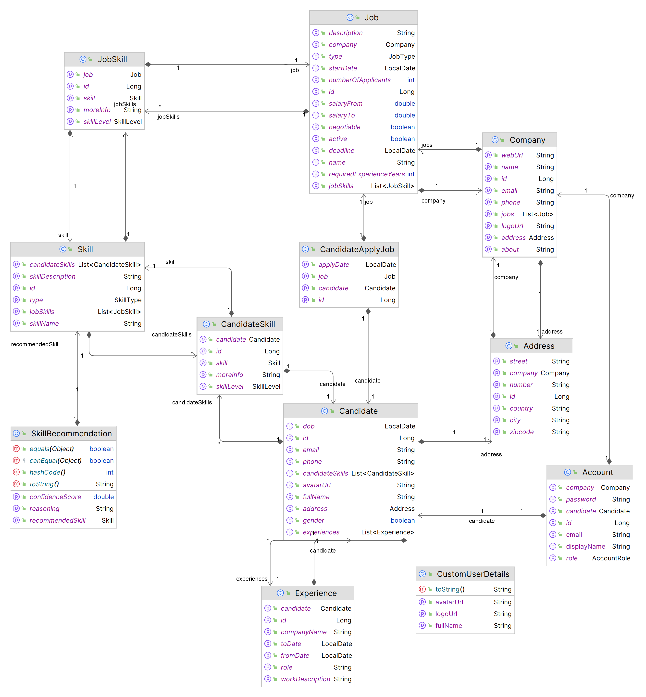
### 4.2 Sơ đồ cơ sở dữ liệu
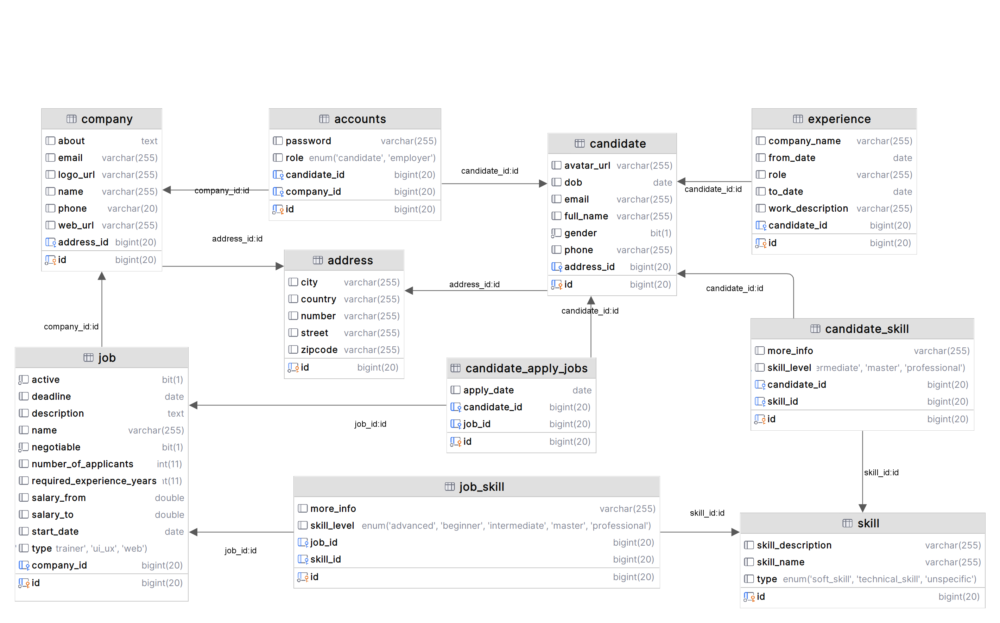


## 5. Cấu trúc dự án
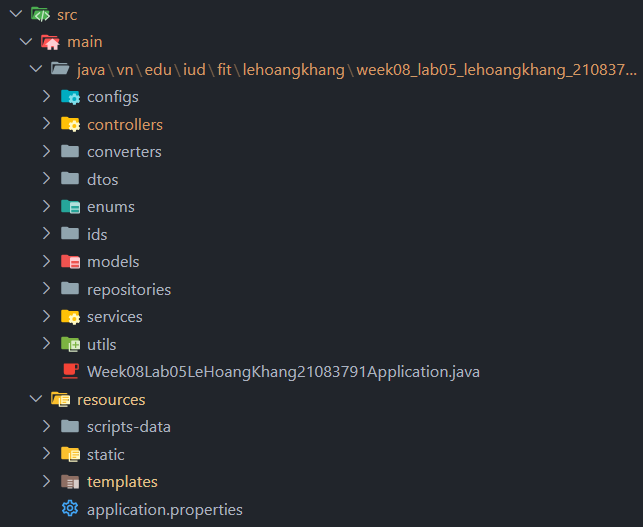

---

## 5. Giao diện và hình ảnh
### 5.1 Trang chủ
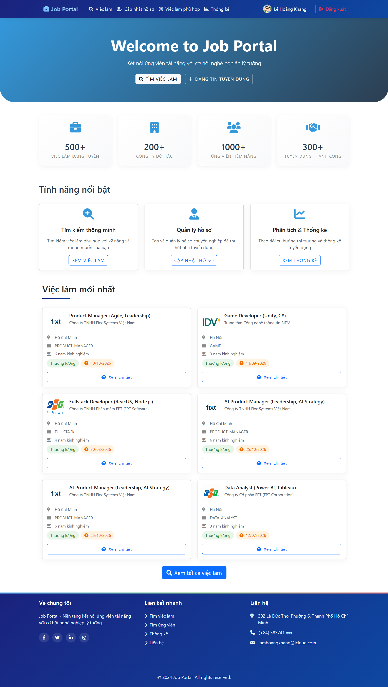
### 5.2 Đăng nhập
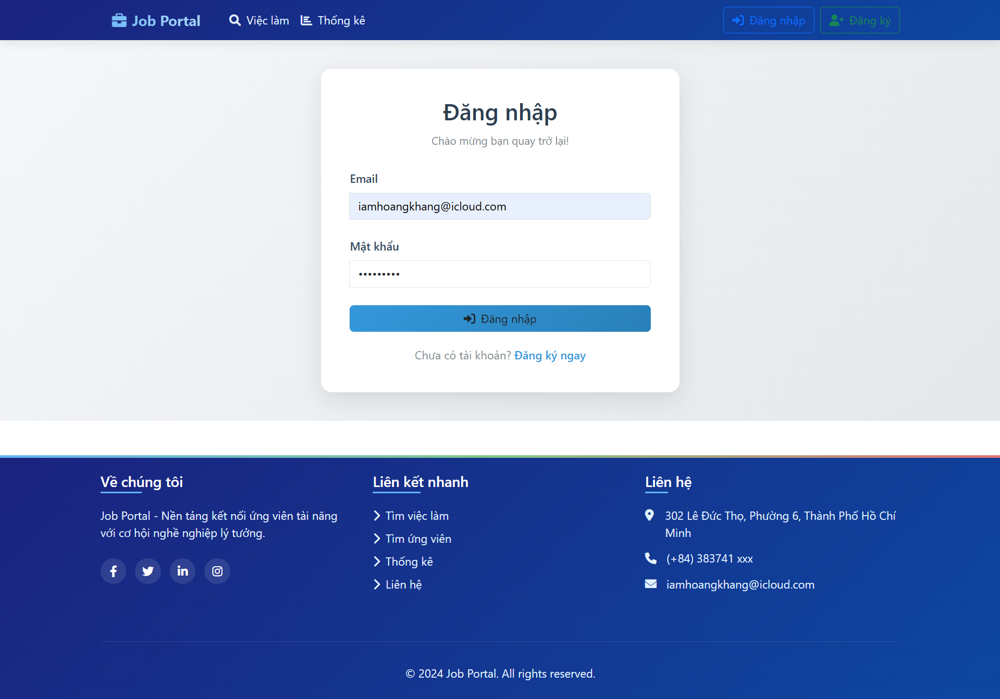
### 5.3 Đăng ký
#### 5.3.1 Đăng ký tài khoản ứng viên
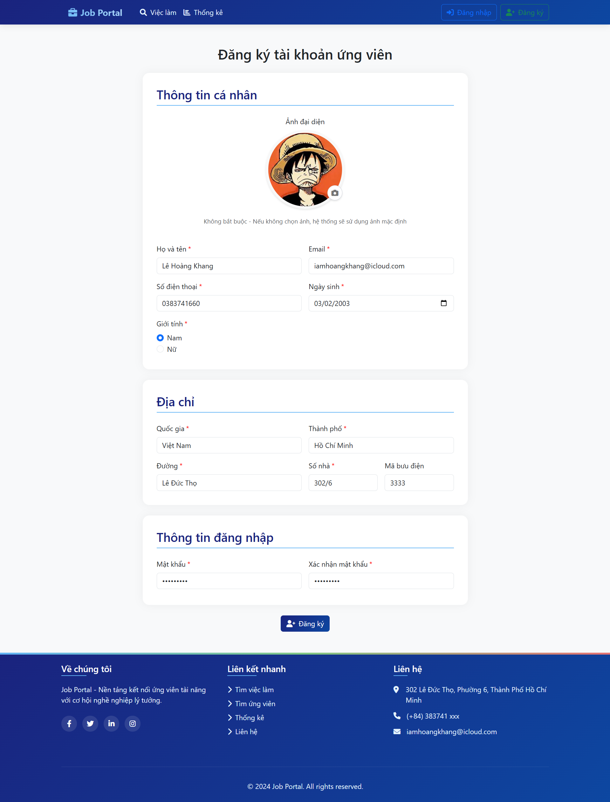
#### 5.3.2 Đăng ký tài khoản doanh nghiệp
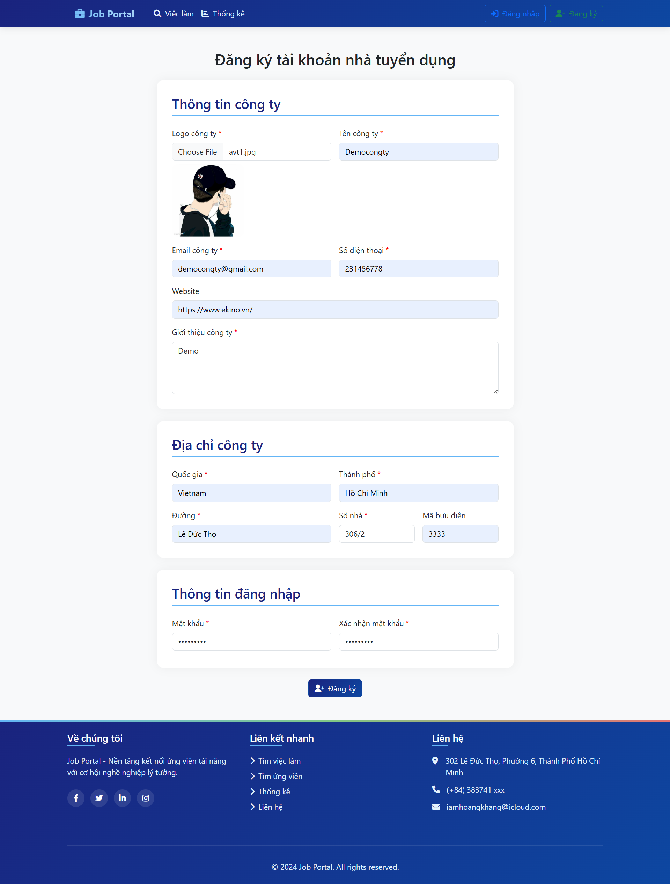
### 5.4 Danh sách công việc
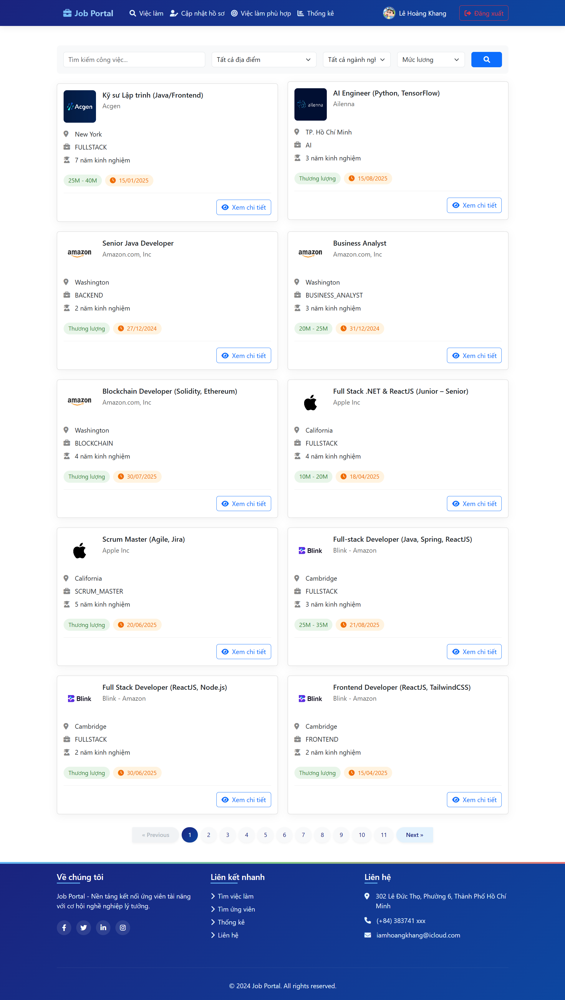
### 5.5 Thông tin chi tiết công việc
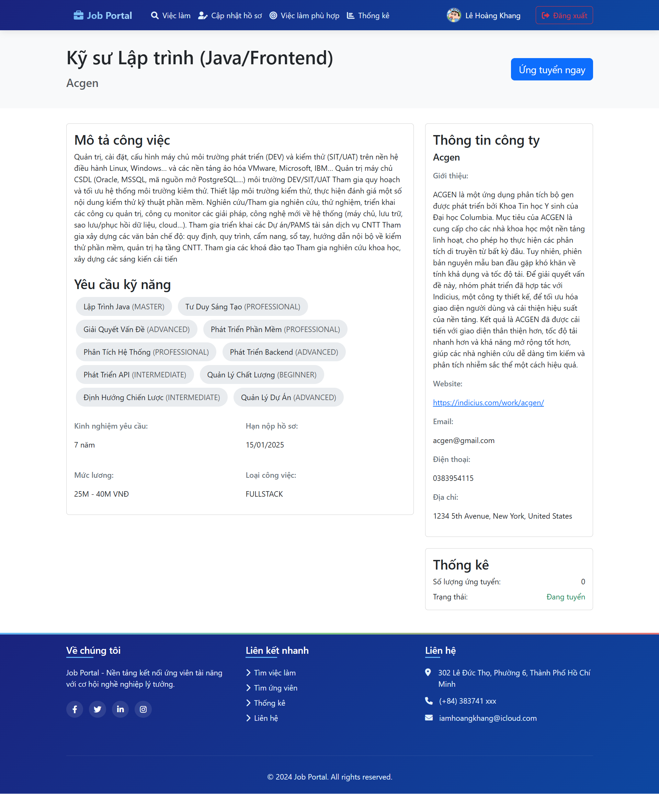
### 5.6 Thống kê tình hình việc làm
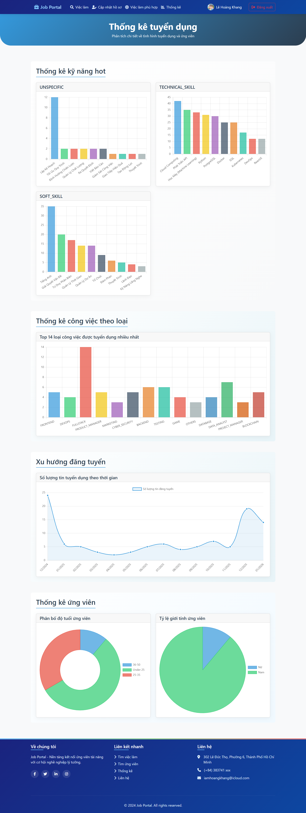
### 5.7 Gợi ý công việc
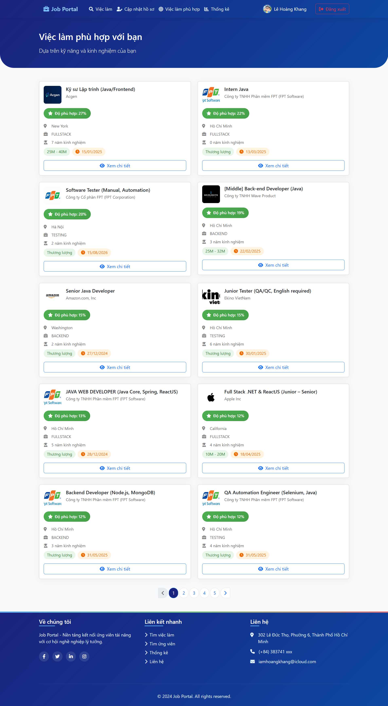
### 5.8 Profile ứng viên
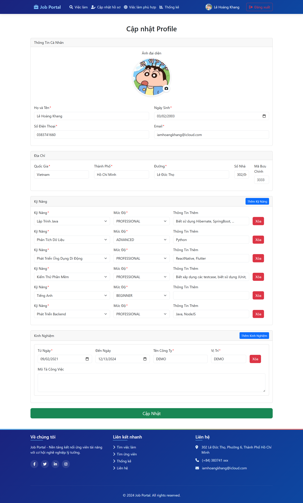
### 5.9 Dashboard doanh nghiệp
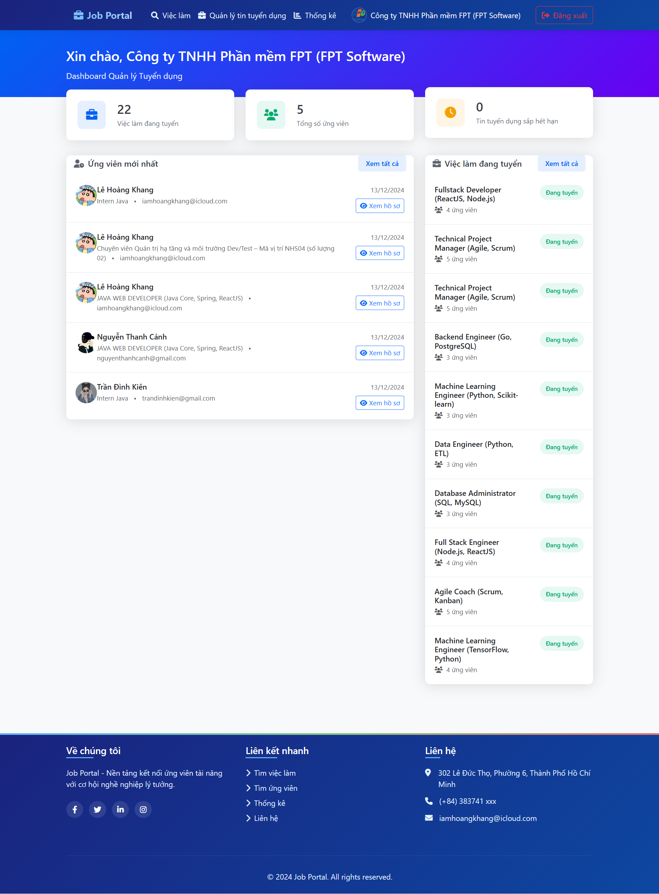
### 5.10 Quản lý tin tuyển dụng
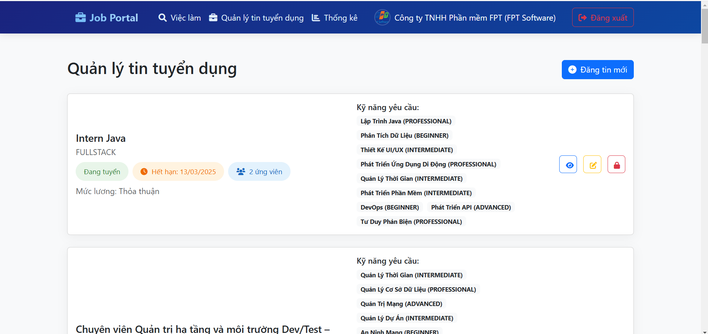
### 5.11 Đăng tin tuyển dụng
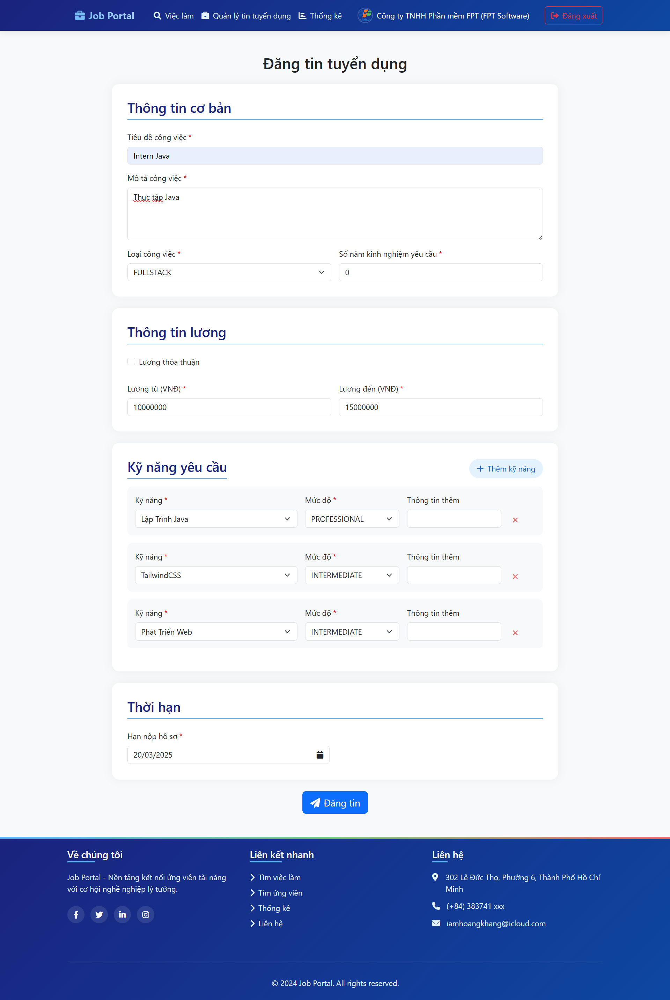
### 5.12 Quản lý chi tiết tin tuyển dụng
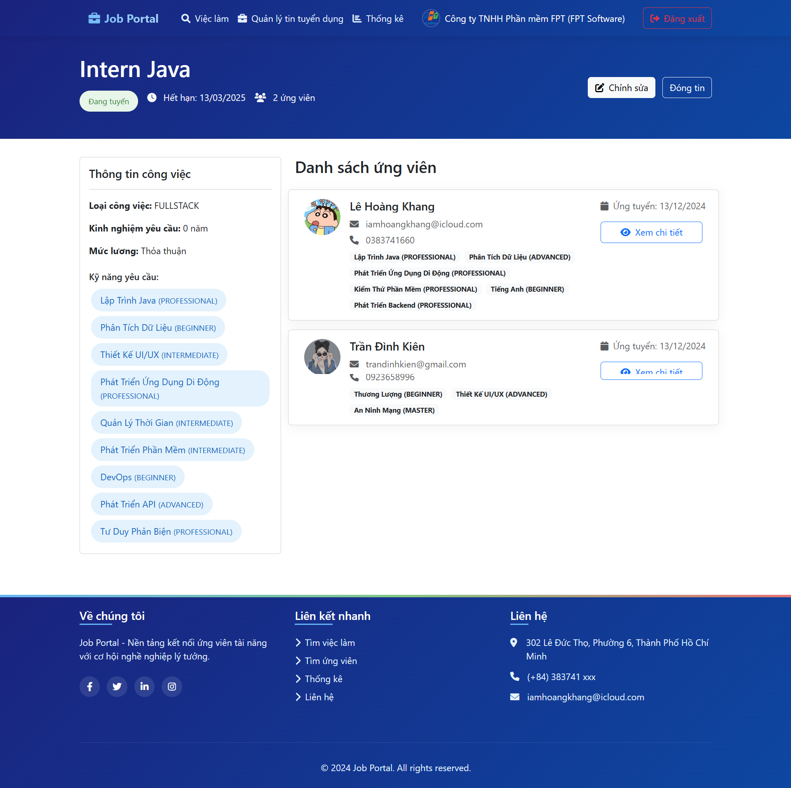

## 8. Thông tin thêm
- **Spring Boot**: [https://spring.io/projects/spring-boot](https://spring.io/projects/spring-boot)
- **Thymeleaf**: [https://www.thymeleaf.org](https://www.thymeleaf.org)
- **Bootstrap**: [https://getbootstrap.com](https://getbootstrap.com)
- **ChartJS**: [https://www.chartjs.org/](https://www.chartjs.org/)

---
